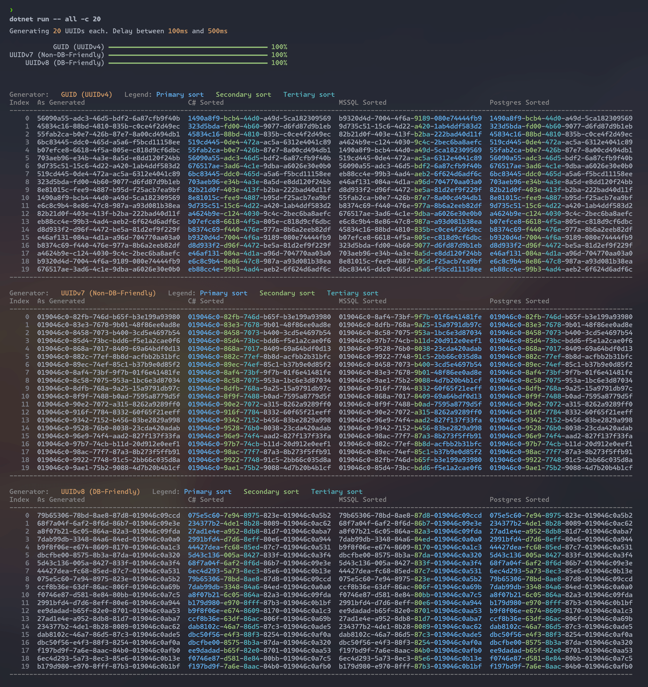

# UUID v7/v8 sorting

A demo I built to help me understand how new UUID specs will handle sorting in code and different databases.

Generates a specified number of UUIDs using the following formats:

- UUIDv4 (using GUID)
- UUIDv7 (using [UUIDNext](https://github.com/mareek/UUIDNext?tab=readme-ov-file))
- UUIDv8 (using [UUIDNext](https://github.com/mareek/UUIDNext?tab=readme-ov-file))

It then sorts all of them using the following methods:

- Using C#'s sorting of a `Guid`
- Using SQL Server's sorting of a `uniqueidentifier`
- Using PostgreSQL's sorting of a `uuid`

All generated UUIDs and sorting results are output to the console with syntax highlighting to show how each method sorts the UUIDs.

## Usage

1. Clone the repo
1. Install database containers using docker

    ```bash
    docker compose up -d
    ```

1. Run the project

    ```bash
    cd Project
    dotnet run -- -c 10
    ```

## Options

- `-c|--count` - The number of UUIDs to generate for each specification (default 10)
- `-m|--min-delay` - Timestamp representing the minimum delay between each UUID generation (default 00:00:00.100 - 100ms)
- `-M|--max-delay` - Timestamp representing the maximum delay between each UUID generation (default 00:00:00.500 - 500ms)

## Output


